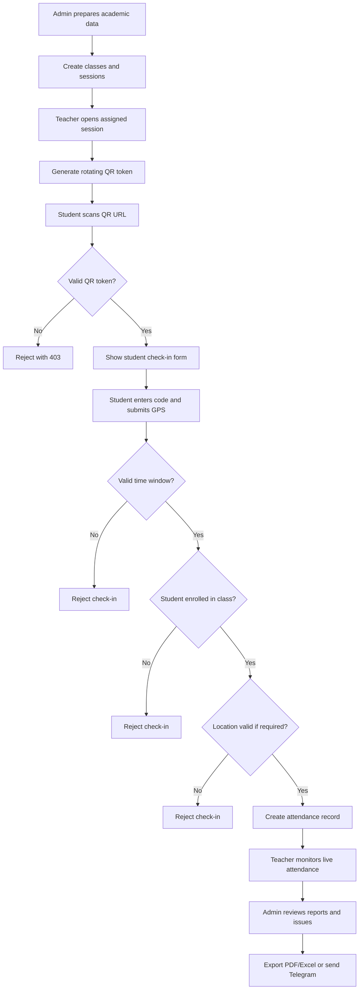
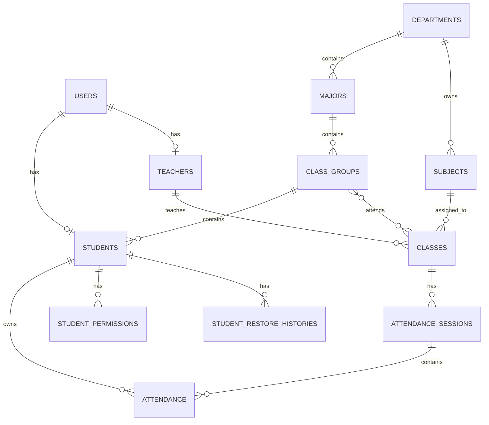

# Academic Attendance Management System - Project Flow Documentation

## 1. Project Summary

The Academic Attendance Management System is a Laravel-based web application for managing university attendance, academic records, teacher activities, semester scores, reports, and notifications.

The system replaces manual paper attendance with a controlled digital workflow:

1. Admin prepares academic data.
2. Teacher opens or manages an attendance session.
3. Teacher generates a secure QR code.
4. Student scans the QR code and submits their student code.
5. System validates QR token, time window, class enrollment, duplicate records, and location if enabled.
6. Attendance is saved as present or late.
7. Teacher and admin monitor attendance results.
8. Reports, exports, issue lists, and Telegram notifications are generated.

The project is designed for academic institutions that need better attendance accuracy, faster reporting, and clearer visibility into student absence problems.

## 2. Technology Stack

| Layer | Technology |
| --- | --- |
| Backend Framework | Laravel 12 |
| Language | PHP 8.2+ |
| Database | MySQL |
| Authentication | Laravel web auth and Laravel Sanctum |
| Frontend | Blade templates, CSS, JavaScript |
| Build Tool | Vite |
| Reports | DomPDF, Maatwebsite Excel |
| Notifications | Telegram Bot API |
| Cache / Queue Support | Redis |
| Deployment | Docker Compose, Nginx, PHP-FPM |

## 3. Main User Roles

### Super Admin

Super Admin has the highest access level. This role can approve users, delete protected records, manage administrative data, and perform high-impact system actions.

Typical responsibilities:

- Approve admin or teacher accounts.
- Delete users, students, instructors, subjects, classes, semesters, and restricted records.
- Manage system-wide academic structure.
- Review attendance problems and restore or blacklist students.

### Admin

Admin manages academic data and monitors the institution-wide attendance process.

Typical responsibilities:

- Manage students, instructors, departments, majors, class groups, subjects, and classes.
- Manage attendance sessions and class schedules.
- Review dashboard statistics.
- Review attendance issue reports.
- Manage student permissions for excused absences.
- Export PDF and Excel reports.
- Configure Telegram bot settings.

### Teacher

Teacher manages attendance and scores for assigned classes.

Typical responsibilities:

- View assigned classes and sessions.
- Generate or regenerate QR codes.
- Monitor live attendance.
- Manually mark attendance when needed.
- Update session status.
- Enter semester scores.
- Export subject score reports.

### Student

Student uses the attendance check-in flow.

Typical responsibilities:

- Scan the teacher's QR code.
- Submit student code.
- Allow GPS location when required.
- View attendance status or history through student API/portal features.

## 4. Project Structure

```text
app/
  Exports/                 Excel export classes
  Http/Controllers/        Web and API controllers
  Http/Middleware/         Role and demo-readonly middleware
  Models/                  Eloquent models
  Services/                Business logic services

config/                    Laravel and integration configuration
database/
  migrations/              Database schema changes
  seeders/                 Initial/default data
  factories/               Test/demo model factories

resources/
  views/                   Blade web pages
  js/                      Frontend JavaScript entry files
  css/                     Frontend CSS entry files

routes/
  web.php                  Browser routes
  api.php                  API routes
  console.php              Console route definitions

public/                    Public assets and entry point
docs/                      Project documentation and images
storage/                   Laravel runtime storage
```

## 5. Core Modules

### Authentication Module

The authentication module controls login, registration, logout, demo login, and API authentication.

Important files:

- `routes/web.php`
- `routes/api.php`
- `app/Http/Controllers/Auth/WebAuthController.php`
- `app/Http/Controllers/Api/AuthController.php`
- `app/Http/Middleware/RoleMiddleware.php`
- `app/Http/Middleware/DemoReadOnlyMiddleware.php`

Main behavior:

1. Guest users can open login or register pages.
2. Approved users can log in.
3. Role middleware restricts admin, super admin, and teacher pages.
4. API routes use Sanctum authentication for protected mobile/API access.
5. Demo mode can block write actions through `demo.readonly` middleware.

### Admin Management Module

The admin module manages institution data and reporting.

Important files:

- `app/Http/Controllers/Admin/AdminController.php`
- `app/Http/Controllers/Api/AdminController.php`
- `resources/views/admin/*.blade.php`
- `app/Exports/*.php`

Main managed data:

- Students
- Instructors
- Departments
- Majors
- Class groups
- Subjects
- Classes/courses
- Attendance sessions
- Student permissions
- Semester results
- Telegram bots
- System settings

### Teacher Module

The teacher module focuses on assigned classes, QR sessions, live attendance, manual overrides, and score entry.

Important files:

- `app/Http/Controllers/Api/TeacherController.php`
- `resources/views/teacher/reports.blade.php`
- `resources/views/dashboard.blade.php`

Main behavior:

1. Teacher logs in.
2. System loads classes assigned to that teacher.
3. Teacher selects a class/session.
4. Teacher generates QR code for student check-in.
5. Students check in using the generated scan URL.
6. Teacher monitors attendance records.
7. Teacher can manually check in a student or delete/reset attendance when permitted.
8. Teacher updates semester scores and exports reports.

### Student Attendance Module

The student attendance module handles QR scan check-in.

Important files:

- `resources/views/student_scan.blade.php`
- `app/Http/Controllers/DashboardController.php`
- `app/Http/Controllers/Api/AttendanceController.php`
- `app/Services/AttendanceService.php`

Main behavior:

1. Student scans QR code from teacher screen.
2. Browser opens `/scan/{session_id}?token={qr_token}`.
3. System validates that the token matches the current session token.
4. Student enters student code.
5. Browser attempts to capture GPS coordinates.
6. Form submits to `/verify-attendance`.
7. Backend validates check-in rules.
8. Attendance is saved as `present` or `late`.

### Attendance Issue Module

This module helps admins find students with absence problems.

Important files:

- `resources/views/admin/attendance_issues.blade.php`
- `app/Http/Controllers/Admin/AdminController.php`
- `app/Services/SemesterAttendanceScoreService.php`

Main behavior:

1. Admin selects academic year and semester.
2. System counts completed attendance sessions.
3. System compares required attendance against actual records.
4. Students with high absence counts are marked as at-risk or blacklisted depending on thresholds.
5. Admin can export issue reports to PDF.
6. Admin can send issue summaries through Telegram.
7. Restore history is tracked when a student is restored.

### Reporting And Export Module

Reports convert system records into usable academic documents.

Important files:

- `app/Exports/*.php`
- `resources/views/admin/exports/*.blade.php`
- `resources/views/pdf/*.blade.php`
- `barryvdh/laravel-dompdf`
- `maatwebsite/excel`

Report examples:

- Student list export
- Instructor list export
- Course list export
- Subject list export
- Department list export
- Attendance export
- Attendance issue PDF
- Semester result PDF/Excel
- Subject score export
- Institutional summary export

### Telegram Notification Module

Telegram integration sends reports and summaries to a configured Telegram chat.

Important files:

- `app/Services/TelegramService.php`
- `app/Http/Controllers/Admin/TelegramBotController.php`
- `resources/views/admin/settings.blade.php`
- `app/Models/TelegramBot.php`

Main behavior:

1. Admin configures a Telegram bot token.
2. Admin activates one bot.
3. System can sync chat IDs from bot updates.
4. Admin can send test messages.
5. Reports and attendance summaries can be sent through Telegram.

## 6. Full Attendance Flow

### Phase 1: Academic Setup

The system starts with academic data preparation.

1. Admin creates departments.
2. Admin creates majors under departments.
3. Admin creates class groups, usually connected to major and year level.
4. Admin creates subjects.
5. Admin creates instructor accounts and teacher profiles.
6. Admin creates students and assigns them to groups/majors.
7. Admin creates classes/courses and assigns:
   - Subject
   - Teacher
   - Class group or groups
   - Academic year
   - Semester
   - Schedule
8. System generates or stores attendance sessions for class meetings.

Output of this phase:

- Students exist in the database.
- Teachers are assigned to classes.
- Classes are connected to subjects and groups.
- Sessions are ready for attendance.

### Phase 2: Teacher Opens Attendance Session

1. Teacher logs into the system.
2. Teacher opens dashboard or teacher reports page.
3. System loads sessions belonging to that teacher.
4. Session status is synced based on time:
   - `scheduled` becomes `active` when current time is inside session time.
   - old sessions can become `completed`.
5. Teacher selects active session.

Output of this phase:

- Teacher has an active session ready for QR generation.

### Phase 3: QR Generation

1. Teacher requests QR code for a session.
2. Backend checks that the session belongs to the teacher.
3. Backend checks attendance window rules.
4. Backend generates a new random QR token.
5. Backend saves token in `attendance_sessions.qr_token`.
6. Backend returns a scan URL:

```text
/scan/{session_id}?token={qr_token}
```

Security purpose:

- The QR token prevents students from checking in with only a session ID.
- Token rotation reduces risk from shared screenshots.
- The scan page rejects missing or expired tokens.

### Phase 4: Student Scans QR Code

1. Student scans the QR code using a phone camera or QR scanner.
2. Browser opens the scan URL.
3. Web route loads the session.
4. System compares the URL token with the session's current QR token using constant-time comparison.
5. If token is invalid, system returns `403`.
6. If token is valid, system displays the student check-in page.

Student page shows:

- Subject name
- Room/time summary
- Student code input
- Hidden session ID
- Hidden QR token
- Hidden latitude, longitude, and accuracy fields

### Phase 5: Student Submits Check-In

1. Student enters student code.
2. Browser attempts to request GPS location.
3. If GPS succeeds, coordinates and accuracy are submitted.
4. If GPS fails, form still submits and backend decides based on system setting.
5. Form posts to `/verify-attendance`.

Submitted data:

```text
session_id
student_code
qr_token
latitude
longitude
accuracy
```

### Phase 6: Backend Attendance Validation

The main validation logic is inside `AttendanceService::processCheckin()`.

Validation order:

1. Load attendance session with class and groups.
2. Validate check-in time window.
3. Validate QR token.
4. Validate location if location setting is enabled.
5. Validate that student code exists.
6. Validate that student belongs to one of the class groups.
7. Check for existing attendance record.
8. Determine attendance status:
   - `present` when inside grace period.
   - `late` when after grace period.
9. Save or update attendance record.
10. Store user location audit data when coordinates are available.

Failure examples:

- QR token is missing or expired.
- Student scans before check-in opens.
- Student scans after check-in closes.
- Student code does not exist.
- Student is not enrolled in that class.
- Student already checked in.
- Student is outside allowed campus radius.
- GPS accuracy is too low.

### Phase 7: Attendance Record Creation

Attendance is stored in the `attendance` table.

Main fields:

```text
student_id
session_id
status
method
scan_time
```

Important rules:

- One student can only have one record per session.
- QR check-ins use method `qr`.
- Manual teacher entries use method `manual`.
- Existing attendance can be updated through controlled teacher/admin actions.

### Phase 8: Live Monitoring

Teacher can monitor the session while students check in.

Live monitoring shows:

- Student list
- Attendance status
- Check-in time
- Check-in method
- Present count
- Late count
- Absent count
- Attendance percentage

Admin dashboard also uses attendance records to show institution-level progress and risks.

### Phase 9: Session Completion

A session can be completed manually or automatically based on time.

After completion:

1. Attendance records become part of reports.
2. Absence counts can affect attendance issue reports.
3. Telegram reports may be sent if configured.
4. Semester scoring can include attendance calculations.

### Phase 10: Attendance Issues

The attendance issue workflow identifies students with repeated absences.

Typical logic:

1. Admin opens attendance issue page.
2. Admin filters by academic year and semester.
3. System gets completed sessions.
4. System counts each student's attendance.
5. System detects missing sessions.
6. Permissions/excused absences are considered.
7. Students are categorized by absence count.
8. Admin can blacklist or restore students.
9. Restore history is recorded.
10. Reports can be exported or sent to Telegram.

### Phase 11: Semester Scores

Semester score flow combines attendance and academic scores.

1. Teacher or admin opens semester assignment.
2. System loads students in that class.
3. System calculates attendance score from attendance records.
4. Teacher/admin enters midterm, assignment, final, and teacher score.
5. System calculates total score.
6. Results can be previewed, saved, exported, or printed.

Score components include:

- Attendance score
- Midterm score
- Assignment score
- Final score
- Teacher score
- Total score

### Phase 12: Reports And Notifications

Reports are generated from database records and exported as PDF or Excel.

Report flow:

1. User selects report type.
2. System loads related records.
3. System formats data.
4. User downloads PDF/Excel or sends Telegram message.
5. Telegram service sends summary and/or attached document when configured.

## 7. System Flow Diagram



## 8. Data Relationship Overview



## 9. Important Routes

### Web Routes

| Route | Purpose |
| --- | --- |
| `GET /login` | Show login page |
| `POST /login` | Login user |
| `POST /demo-login` | Open demo workspace |
| `GET /` | Dashboard |
| `GET /teacher/reports` | Teacher reports and monitoring |
| `POST /regenerate-qr` | Regenerate web QR token |
| `POST /simulate-scan` | Simulate attendance scan |
| `GET /admin/students` | Admin student management |
| `GET /admin/courses` | Admin course/class management |
| `GET /admin/attendance-issues` | Attendance issue dashboard |
| `GET /scan/{session_id}` | Student QR scan page |
| `POST /verify-attendance` | Submit web attendance check-in |

### API Routes

| Route | Purpose |
| --- | --- |
| `POST /api/login` | API login |
| `GET /api/profile` | Current user profile |
| `GET /api/teacher/classes` | Teacher classes |
| `GET /api/teacher/session/{id}/qr` | Generate teacher QR |
| `POST /api/teacher/session/{id}/regenerate-qr` | Regenerate teacher QR |
| `GET /api/teacher/session/{id}/monitor` | Monitor session attendance |
| `POST /api/teacher/session/{id}/checkin` | Manual teacher check-in |
| `GET /api/admin/stats` | Admin statistics |
| `GET /api/admin/classes` | List classes |
| `GET /api/admin/session/{id}/attendance` | Session attendance list |
| `GET /api/student/scan/{id}` | Student scan session info |
| `POST /api/student/verify` | API attendance check-in |
| `POST /api/location/record` | Record user location |

## 10. Security Design

Security controls used in the project:

- Login authentication for protected web pages.
- Sanctum authentication for protected API routes.
- Role middleware for admin, super admin, and teacher access.
- Demo read-only middleware to protect demo data.
- QR token validation before check-in.
- Rotating QR token generation.
- Constant-time QR token comparison.
- Check-in time window validation.
- Student enrollment validation.
- Duplicate attendance prevention.
- Optional GPS/geofencing validation.
- Teacher ownership checks for teacher session actions.
- CSRF protection on web forms.

## 11. Performance Design

Performance improvements and patterns used:

- Eloquent relationships are eager-loaded in many dashboard and API flows.
- Attendance records use a unique key for student/session check-in.
- Database indexes exist for attendance issue queries and session filters.
- Report generation is separated into export classes.
- Shared attendance logic is centralized in service classes.
- Dashboard queries limit recent records where possible.
- Redis is available for cache/queue support.

Potential future improvements:

- Add pagination to all large admin tables.
- Queue large PDF/Excel exports.
- Cache dashboard aggregate counts.
- Add more database indexes for frequently filtered route/API queries.
- Move repeated dashboard calculations into query-level aggregation.
- Add automated tests for QR check-in and role permissions.

## 12. Deployment Flow

Basic Docker deployment:

```bash
docker compose up -d --build
docker compose exec app php artisan migrate --force
```

Application URLs:

```text
Web app:    http://localhost:8080
phpMyAdmin: http://localhost:8081
MySQL:      localhost:3307
```

Common Laravel maintenance commands:

```bash
docker compose exec app php artisan config:clear
docker compose exec app php artisan cache:clear
docker compose exec app php artisan route:clear
docker compose exec app php artisan view:clear
docker compose exec app php artisan migrate --force
```

## 13. End-To-End Example Scenario

Example: Morning database class attendance.

1. Admin creates `Database Systems` subject.
2. Admin creates class group `IT Year 3`.
3. Admin creates teacher account for the database instructor.
4. Admin creates students and assigns them to `IT Year 3`.
5. Admin creates a class for `Database Systems`, assigns the teacher, and links `IT Year 3`.
6. Attendance session is scheduled from `08:00` to `10:00`.
7. Teacher logs in before class.
8. Teacher opens the active session.
9. Teacher clicks generate QR.
10. System creates a new QR token and scan URL.
11. Students scan the QR code.
12. Scan page validates token.
13. Student enters student code.
14. Browser submits student code, token, and GPS data.
15. Backend validates time, token, location, and enrollment.
16. System saves attendance as `present`.
17. A student who checks in after grace period is saved as `late`.
18. Teacher sees live attendance count.
19. After class, session becomes completed.
20. Admin reviews attendance issue report at semester level.
21. System exports final attendance report to PDF/Excel.

## 14. Current System Notes

- The QR scan flow uses a URL-based QR code, not an in-browser camera scanner.
- Students use their phone camera or another QR scanner app to open the scan URL.
- The web check-in flow now requires the QR token in the scan URL.
- If location validation is enabled, students must allow browser location access.
- Local PHP may not be installed on the host machine, so Laravel commands are usually run through Docker.
- The project already includes broad thesis documentation in `docs/README.md`; this file focuses on implementation flow and system behavior.

