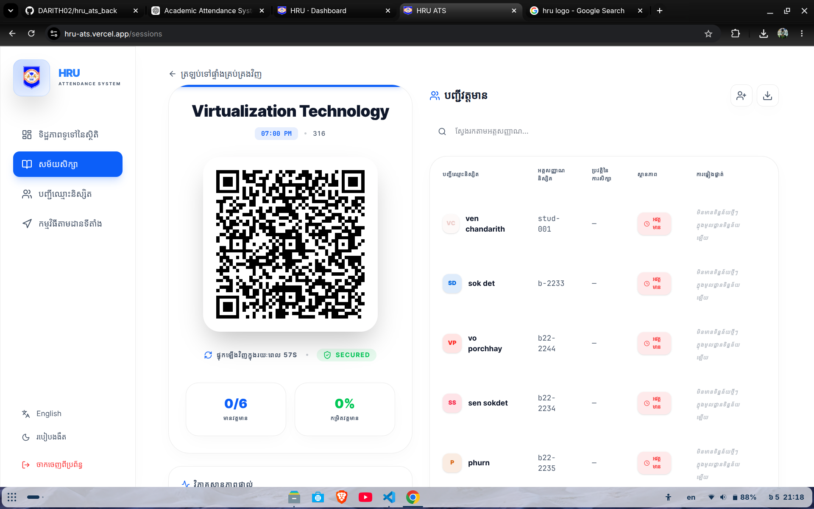
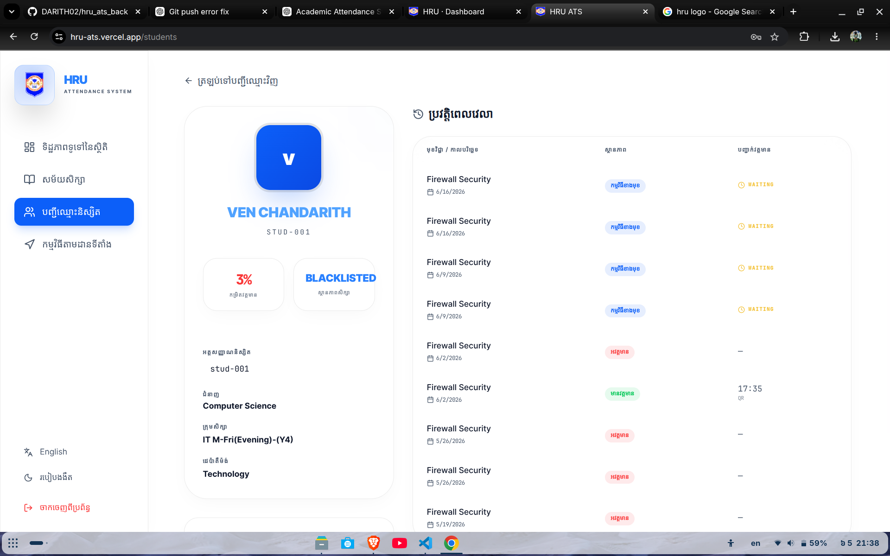

# Repository Information

This directory contains supporting documentation and visual assets for the Academic Attendance Management System repository.

For the full project overview, setup steps, security notes, workflow, and production checklist, see the root [README.md](../README.md).

## Project Summary

The Academic Attendance Management System is a Laravel-based platform for managing student attendance, teacher sessions, academic records, semester scores, reports, and administrative operations.

The system replaces manual attendance tracking with a digital workflow that supports QR check-in, live teacher monitoring, role-based access, admin dashboards, PDF and Excel exports, and Telegram notifications.

## Main Capabilities

- Web and API authentication with Laravel Sanctum support.
- Role-based access for super admins, admins, teachers, and students.
- QR-based attendance sessions with token regeneration.
- Teacher-owned class sessions, attendance monitoring, and score management.
- Admin management for students, instructors, courses, departments, subjects, majors, groups, permissions, and reports.
- Semester score tracking and attendance issue reporting.
- Telegram bot integration for notifications and report delivery.
- Docker-based local development environment.

## Technology Stack

- Laravel 12
- PHP 8.2+
- MySQL
- Redis
- Nginx
- Docker Compose
- Vite
- Blade templates
- Laravel Sanctum
- Maatwebsite Excel
- DomPDF
- Cloudinary
- Telegram Bot API

## ព័ត៌មានអំពី Repository

ថតនេះមានឯកសារជំនួយ និងរូបភាពសម្រាប់ Repository របស់ប្រព័ន្ធគ្រប់គ្រងវត្តមានសិក្សា។

សម្រាប់ព័ត៌មានទូទៅអំពីគម្រោង ជំហានដំឡើង កំណត់ចំណាំសុវត្ថិភាព លំហូរការងារ និងបញ្ជីត្រួតពិនិត្យសម្រាប់ Production សូមមើល [README.md](../README.md) នៅ root របស់គម្រោង។

## សេចក្តីសង្ខេបគម្រោង

ប្រព័ន្ធគ្រប់គ្រងវត្តមានសិក្សា គឺជាប្រព័ន្ធដែលបង្កើតដោយ Laravel សម្រាប់គ្រប់គ្រងវត្តមានសិស្ស សម័យបង្រៀនរបស់គ្រូ កំណត់ត្រាសិក្សា ពិន្ទុប្រចាំឆមាស របាយការណ៍ និងប្រតិបត្តិការរដ្ឋបាល។

ប្រព័ន្ធនេះជំនួសការតាមដានវត្តមានដោយដៃ ដោយប្រើលំហូរការងារឌីជីថល ដែលមាន QR check-in ការតាមដានវត្តមានផ្ទាល់ដោយគ្រូ ការគ្រប់គ្រងសិទ្ធិតាមតួនាទី Dashboard សម្រាប់ Admin ការនាំចេញ PDF និង Excel និងការជូនដំណឹងតាម Telegram។

## សមត្ថភាពសំខាន់ៗ

- ចូលប្រើតាម Web និង API ដោយគាំទ្រ Laravel Sanctum។
- គ្រប់គ្រងសិទ្ធិតាមតួនាទីសម្រាប់ Super Admin, Admin, Teacher និង Student។
- គ្រប់គ្រងវត្តមានតាម QR code និងអាចបង្កើត token ថ្មី។
- គ្រូអាចគ្រប់គ្រងថ្នាក់ សម័យវត្តមាន ការតាមដានវត្តមាន និងពិន្ទុ។
- Admin អាចគ្រប់គ្រងសិស្ស គ្រូបង្រៀន មុខវិជ្ជា ថ្នាក់ ដេប៉ាតឺម៉ង់ ជំនាញ ក្រុម សិទ្ធិ និងរបាយការណ៍។
- តាមដានពិន្ទុប្រចាំឆមាស និងរបាយការណ៍បញ្ហាវត្តមាន។
- ភ្ជាប់ Telegram bot សម្រាប់ផ្ញើការជូនដំណឹង និងរបាយការណ៍។
- គាំទ្របរិស្ថានអភិវឌ្ឍន៍ក្នុងស្រុកដោយ Docker។

## បច្ចេកវិទ្យាដែលប្រើ

- Laravel 12
- PHP 8.2+
- MySQL
- Redis
- Nginx
- Docker Compose
- Vite
- Blade templates
- Laravel Sanctum
- Maatwebsite Excel
- DomPDF
- Cloudinary
- Telegram Bot API

## Screenshots And Assets

### Branding


### Dashboard


### QR Attendance



### Attendance Report



### Telegram Notification


## Local Development

Start the local Docker environment from the repository root:

```bash
docker compose up -d --build
```

Local URLs:

```text
Application: http://localhost:8080
phpMyAdmin:  http://localhost:8081
```

Useful commands:

```bash
docker compose exec app php artisan optimize:clear
docker compose exec app php artisan migrate --force
docker compose exec app composer audit --locked
npm audit --omit=dev
```

## ការអភិវឌ្ឍន៍ក្នុងស្រុក

ចាប់ផ្តើម Docker environment ពី root របស់ repository:

```bash
docker compose up -d --build
```

អាសយដ្ឋានក្នុងស្រុក:

```text
Application: http://localhost:8080
phpMyAdmin:  http://localhost:8081
```

Command មានប្រយោជន៍:

```bash
docker compose exec app php artisan optimize:clear
docker compose exec app php artisan migrate --force
docker compose exec app composer audit --locked
npm audit --omit=dev
```

## Security Notes

- Do not commit real `.env` secrets.
- Keep `APP_DEBUG=false` in production.
- Use a strong `APP_KEY`.
- Rotate exposed credentials before deployment.
- Keep `ALLOW_STUDENT_CODE_LOGIN=false` unless a temporary migration period is required.
- Do not expose MySQL or phpMyAdmin publicly in production.

## កំណត់ចំណាំសុវត្ថិភាព

- កុំ commit secret ពិតប្រាកដក្នុង `.env`។
- កំណត់ `APP_DEBUG=false` នៅក្នុង production។
- ប្រើ `APP_KEY` ដែលមានសុវត្ថិភាពខ្ពស់។
- ផ្លាស់ប្តូរ credential ដែលធ្លាប់បង្ហាញមុនពេល deploy។
- រក្សា `ALLOW_STUDENT_CODE_LOGIN=false` លុះត្រាតែត្រូវការប្រើបណ្តោះអាសន្នសម្រាប់ការផ្លាស់ប្តូរ។
- កុំបើក MySQL ឬ phpMyAdmin ជាសាធារណៈនៅក្នុង production។
